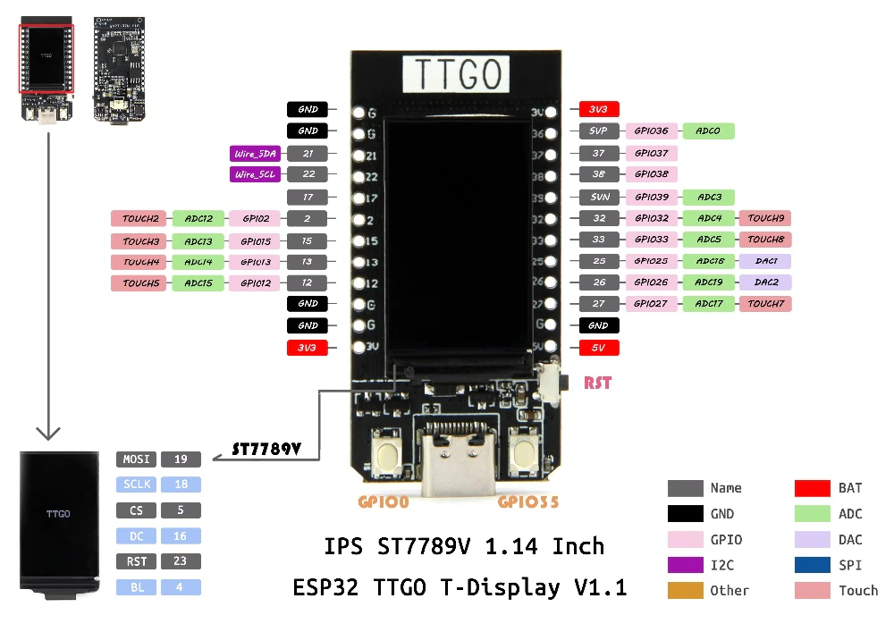

# Tenta-one

First prototype for the Tenta series macro-pads.

The Tenta-one features a 3x4 keypad, extra thumbkey, rotary encoder, a joystick and a 1.14" LCD display. 

The rotary encoder allows for intuitive control for brush size, zoom and rotation.

The joystick aims to allow quick access of up to 8 tools at a time.

The naming for the Tenta series was inspired by Ninomae Ina'nis from Hololive English.

# Components

## Micro-controller

This project uses a [TTGO T-Display ESP32 WiFi and Bluetooth Module Development Board](http://www.lilygo.cn/prod_view.aspx?Id=1126) [clone](https://shopee.sg/T-Display-ESP32-WiFi-And-Bluetooth-Compatible-Module-Development-Board-1.14-Inch-LCD-Control-Board-for-Arduino-i.562720324.17746354681).

[CH9102F](https://datasheet.lcsc.com/lcsc/2108181630_WCH-Jiangsu-Qin-Heng-CH9102F_C2858418.pdf) => USB to High Speed Serial

The board does not have a USD HID compliant chip and therefore requires to be used through Bluetooth.

## Rotary Encoder

[KY-040](https://shopee.sg/5PCS-lot-KY-040-360-Degrees-Rotary-Switch-Encoder-Module-with-15x13.5-mm-Potentiometer-Half-Shaft-Hole-Knob-Caps-for-Arduino-i.240782317.4336310259)

[Reference](https://components101.com/modules/KY-04-rotary-encoder-pinout-features-datasheet-working-application-alternative)


| | |
|-|-|
| CLK (Top) | Output A |
| DT | Output B |
| SW | Switch |
| + | 5V |
| GND | Ground |

## Joystick

[KY-023](https://shopee.sg/For-Arduino-Dual-axis-XY-Joystick-Module-Higher-Quality-PS2-Joystick-Control-Lever-Sensor-KY-023-Rated-4.9-5-i.562720324.14270834301)

[Reference](https://arduinomodules.info/ky-023-joystick-dual-axis-module/)

| | |
|-|-|
| GND (Top) | Ground |
| +5V | 5V |
| VRX | X |
| VRY | Y |
| SW | Switch |

## 3D printed body

https://cad.onshape.com/documents/71e82f812efbf89650c1e64c/w/f942f00be7ac6eea3bae8d07/e/f845f697af69beb1dc31c85d

The rotary encoder knob is custom with large grooves on top to allow it to be easy to turn just by using your thumb.

# Wiring diagram

[ESP32 Datasheet](https://www.espressif.com/sites/default/files/documentation/esp32_datasheet_en.pdf)



Pins are set in `src/config.h`.

## Rotary Encoder
Output A - GPIO339
Output B - GPIO32
Switch - GPIO33

## Joystick
Switch - GPIO27
VRY - GPIO26 | ADC2_CH9
VRX - GPIO25 | ADC2_CH8


# Reference

[ESP32 ADC](https://docs.espressif.com/projects/esp-idf/en/v4.2/esp32/api-reference/peripherals/adc.html)
[ESP32 Pulse Counter](https://docs.espressif.com/projects/esp-idf/en/v4.2/esp32/api-reference/peripherals/pcnt.html)

# Building

This project is using the ESP-IDF 4.4 CMD for building and flashing. As per the instructions, run `idf.py build` in the root directory to build the project and `idf.py -p PORT flash` to flash the device with the build.

# _Sample project_

(See the README.md file in the upper level 'examples' directory for more information about examples.)

This is the simplest buildable example. The example is used by command `idf.py create-project`
that copies the project to user specified path and set it's name. For more information follow the [docs page](https://docs.espressif.com/projects/esp-idf/en/latest/api-guides/build-system.html#start-a-new-project)


## How to use example
We encourage the users to use the example as a template for the new projects.
A recommended way is to follow the instructions on a [docs page](https://docs.espressif.com/projects/esp-idf/en/latest/api-guides/build-system.html#start-a-new-project).

## Example folder contents

The project **sample_project** contains one source file in C language [main.c](main/main.c). The file is located in folder [main](main).

ESP-IDF projects are built using CMake. The project build configuration is contained in `CMakeLists.txt`
files that provide set of directives and instructions describing the project's source files and targets
(executable, library, or both). 

Below is short explanation of remaining files in the project folder.

```
├── CMakeLists.txt
├── main
│   ├── CMakeLists.txt
│   └── main.c
└── README.md                  This is the file you are currently reading
```
Additionally, the sample project contains Makefile and component.mk files, used for the legacy Make based build system. 
They are not used or needed when building with CMake and idf.py.
